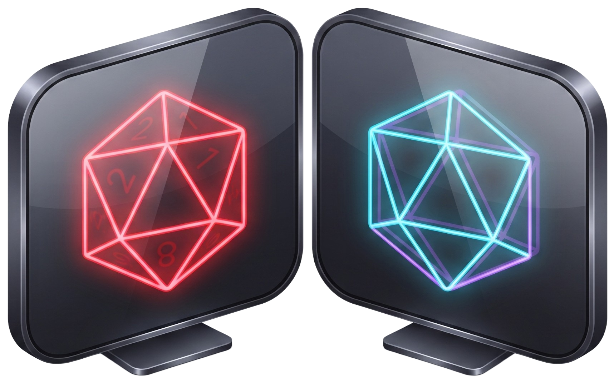

# MasterGlass

  

**MasterGlass** è un'applicazione desktop leggera, moderna e completamente portabile in Python (PyQt6 Vibecoding/Antigravity), progettata specificamente per i **Master** di giochi di ruolo dal vivo o in sessioni ibride. 
Risolve un problema comune a molti Master: proiettare mappe, indizi (handouts), immagini di PNG o mostri su un secondo schermo dedicato ai giocatori (TV sul tavolo, proiettore o monitor a parete) in modo immediato e pulito, senza dover usare software VTT locali o fare scomodi Alt-Tab o trascinamenti al "buio".

La versione Eseguibile Portabile per Windows è presente nella sezione [Release](../../releases).

> [!WARNING]
> **Avviso di sicurezza Windows SmartScreen (PC protetto da Windows):**
> Essendo un progetto amatoriale ed open source, l'eseguibile compilato (`MasterGlass.exe`) **non dispone di una firma digitale** (a causa dei costi annuali di abbonamento per i certificati di firma pubblica).
> Al primo avvio, Windows potrebbe mostrare un avviso di sicurezza blu. Per procedere, clicca su **"Ulteriori informazioni"** e successivamente sul pulsante **"Esegui comunque"**. Il codice sorgente è interamente consultabile in questo repository per massima trasparenza e sicurezza.

   
      

---

## 🚀 Caratteristiche Principali

* **Estetica:** Presentazione automatica sul secondo schermo con sfondo translucido "vetro fumé" scuro, perfetto per esaltare immagini e token con trasparenze PNG.
* **Layout Smart Grid:** Trascina più immagini contemporaneamente (es. la mappa del luogo e i ritratti dei nemici) e l'app le organizzerà in una griglia armonica adatta a ogni schermo (da 1 a infinite immagini).
* **Drag & Drop Flessibile:** 
  * Supporto completo al trascinamento di file e intere cartelle da **Esplora Risorse (Explorer)**.
  * Supporto al trascinamento di immagini direttamente da **Browser Web** (nota: a causa delle protezioni di sicurezza o di formati non standard di alcuni siti, potrebbero verificarsi eccezioni su determinati portali).
* **Copia & Incolla Intelligente:** Supporto alle scorciatoie da tastiera (`Ctrl+V` per sostituire del tutto la schermata, `Ctrl+Shift+V` per aggiungere elementi in coda) di immagini copiate negli appunti o di file da Windows Explorer.
* **Supporto Video & Atmosfere:** Proiezione di video d'atmosfera a schermo intero (MP4, AVI, MKV, ecc.) con gestione di code di riproduzione, riproduzione/replay immediato cliccando sulla miniatura della Regia, e congelamento dell'inquadratura sull'ultimo frame a fine riproduzione.
* **Aree di Rilascio Separate (Aggiungi/Sostituisci):** Overlay grafico dinamico che appare durante il trascinamento per scegliere al volo se azzerare la presentazione o aggiungere elementi.
* **gestione Proiezione:** Visualizzazione lato master delle immagini proiettate con possibilità di eliminazione dei singoli elementi.
* **Guida & Changelog Integrati:** Assistenza d'uso immediata e storico delle modifiche consultabili direttamente dai pulsanti dedicati nella schermata di controllo del Master.

---

## 🖥️ Come Usare MasterGlass al Tavolo

L'applicazione si avvia sdoppiandosi in due finestre:

1. **Finestra di Controllo (Regia)**: Rimane sempre in primo piano sullo schermo del Master. Ti permette di gestire le immagini attive, pulire la coda, visualizzare lo storico delle miniature e cambiare modalità.
   * **Chiudere l'app:** Se chiudi la finestra di Controllo con la `X`, l'intera applicazione verrà terminata all'istante.
2. **Finestra di Visualizzazione (Schermo Giocatori)**: È lo schermo destinato ai giocatori. Puoi passare tra due stati cliccando sul pulsante nella Finestra di Controllo:
   * **Modalità TEST (Rossa)**: Si ancora sul lato destro dello schermo principale con i bordi di Windows per permetterti di provarla senza occupare tutta la scrivania.
   * **Modalità PRESENTAZIONE (Verde)**: Si sposta automaticamente sul secondo schermo rilevato (es. la TV sul tavolo o il proiettore a parete) a tutto schermo (senza bordi) oppure riempie il monitor principale.

---

## 🛠️ Requisiti

* **Sistema operativo Windows**.
* **Python**: Assicurati di aver installato Python sul PC (versione 3.10 o superiore). Puoi scaricarlo gratuitamente dal sito ufficiale [python.org](https://www.python.org/).
  * *IMPORTANTE: Durante l'installazione di Python, assicurati di spuntare la casella **"Add Python to PATH"***!
* **Versione Portable EXE** é disponibile nella sezione Release la versione EXE del software compilato

---

## 📦 Installazione e Avvio

Il progetto è completamente portabile e non inquina il computer con installazioni di sistema.

1. **Scarica il codice:** Clona questo repository o scarica l'archivio ZIP ed estrailo in una cartella a tua scelta.
2. **Setup Iniziale:** Fai doppio clic sul file **`setup.bat`**.
   * Questo script creerà un ambiente virtuale isolato (`.venv`) e installerà la libreria grafica necessaria (`PyQt6`).
   * L'operazione va eseguita solo la prima volta.
3. **Avvio:** Fai doppio clic sul file **`AVVIAMI.vbs`**.
   * Questo avvierà l'applicazione in background nascondendo la finestra nera del terminale Windows.

> [!NOTE]
> Per scopi di sviluppo o se riscontri errori all'avvio, puoi eseguire l'applicazione mostrando il terminale di debug tramite il file `_debug_console_run.bat`.

---

## 🤝 Contribuire

I contributi sono sempre benvenuti! Se hai idee, correzioni di bug o miglioramenti per rendere le sessioni dei Master ancora più epiche:

1. Fai un Fork del progetto.
2. Crea un branch per la tua feature (`git checkout -b feature/NuovaFeature`).
3. Fai un commit delle tue modifiche (`git commit -m 'Aggiungi NuovaFeature'`).
4. Fai un push del branch (`git push origin feature/NuovaFeature`).
5. Apri una Pull Request.

---

## 📄 Licenza

Questo progetto è distribuito sotto la licenza **MIT**. Consulta il file [LICENSE](LICENSE) per ulteriori dettagli.
