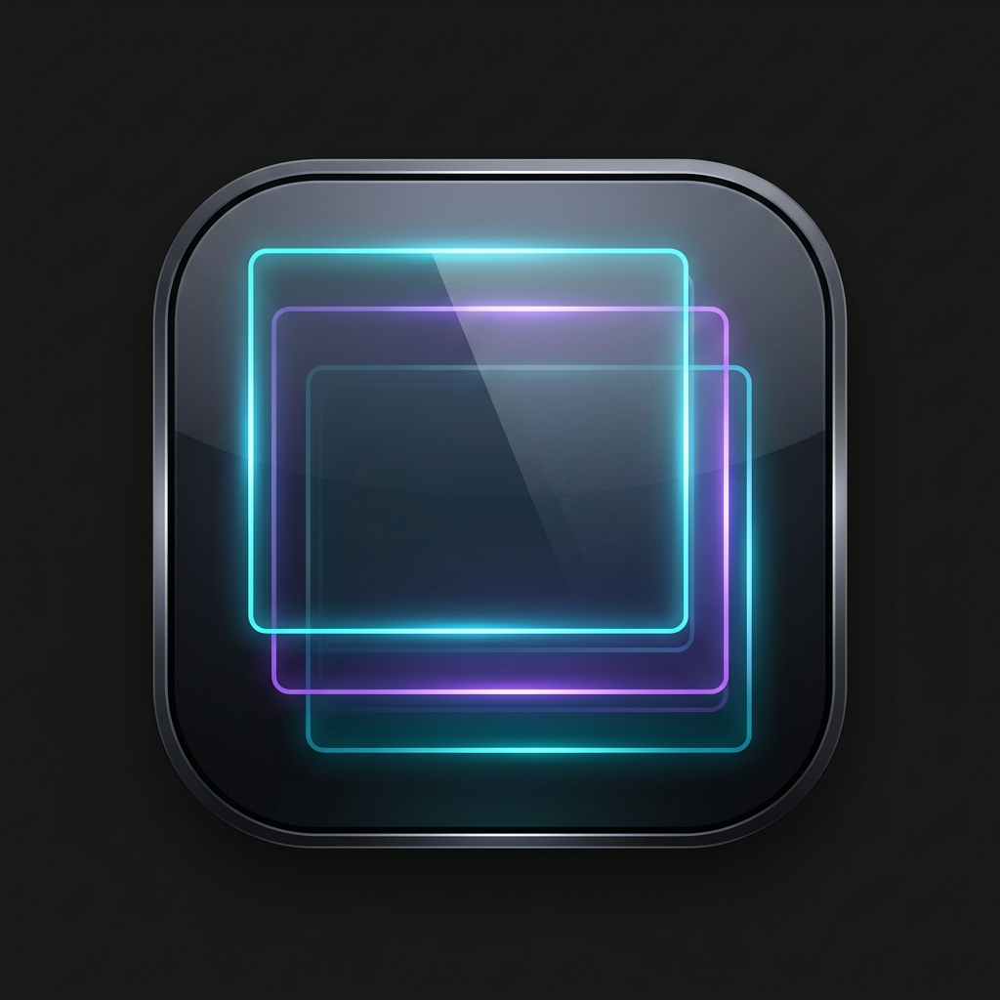

# Presentatore Immagini (Dark Glass)

  

Un'applicazione desktop leggera e moderna in Python (gestita tramite PyQt6) progettata specificamente per mostrare immagini, foto e token (supporto trasparenze PNG multi-livello) su uno schermo secondario o in overlay.

Sviluppata per scenari come le partite di ruolo da tavolo (simil-Foundry VTT) o esibizioni in cui si ha necessità di gestire al volo i layout senza impazzire o fare alt-tab esagerati, mandando i contenuti su un secondo schermo "Presentazione" mantenendo il controllo sullo schermo del Master/Regista.

---

## 🚀 Caratteristiche Principali

* **Estetica Dark Glass:** Rilevazione del secondo schermo con transizioni e overlay translucido "vetro fumé" scuro.
* **Layout Smart Grid:** Trascina più immagini contemporaneamente e l'app le organizzerà automaticamente in una griglia armonica ed elegante (1, 2, 3, 4 o più elementi).
* **Supporto Video & Code:** Visualizzazione di file video (MP4, AVI, MKV, ecc.) a tutto schermo, con replay automatico al click sulla miniatura e fermo immagine sull'ultimo frame.
* **Aree Drop Separate (Aggiungi/Sostituisci):** Possibilità di trascinare file per sostituire l'intera presentazione corrente oppure accodare elementi a quelli già mostrati.
* **Copia & Incolla Intelligente:** Supporto a scorciatoie da tastiera (`Ctrl+V` per sostituire, `Ctrl+Shift+V` per aggiungere) di immagini copiate dal web o file da Esplora File.
* **Storico & Navigazione:** Un archivio sfogliabile all'interno della finestra di controllo per recuperare rapidamente le configurazioni di immagini precedentemente mostrate.
* **Guida e Changelog integrati:** Finestre di documentazione accessibili direttamente dall'applicazione.

---

## 🛠️ Requisiti

* **Sistema operativo Windows**.
* **Python**: Assicurati di aver installato Python sul PC (versione 3.10 o superiore). Puoi scaricarlo gratuitamente dal sito ufficiale [python.org](https://www.python.org/).
  * *IMPORTANTE: Durante l'installazione di Python, assicurati di spuntare la casella **"Add Python to PATH"***!

---

## 📦 Installazione e Avvio

Non c'è bisogno di installare macro-programmi o inquinare il computer. Il progetto è completamente portabile.

1. **Scarica il codice:** Clona questo repository o scarica l'archivio ZIP ed estrailo in una cartella a tua scelta.
2. **Setup Iniziale:** Fai doppio clic sul file **`setup.bat`**.
   * Questo script creerà un ambiente virtuale isolato (`.venv`) e installerà la libreria grafica necessaria (`PyQt6`).
   * L'operazione va eseguita solo la prima volta.
3. **Avvio:** Fai doppio clic sul file **`AVVIAMI.vbs`**.
   * Questo avvierà l'applicazione in background nascondendo la finestra nera del terminale Windows.

> [!NOTE]
> Per scopi di sviluppo o se riscontri errori all'avvio, puoi eseguire l'applicazione mostrando il terminale di debug tramite il file `_debug_console_run.bat`.

---

## 🖥️ Come Usare l'Applicazione

L'applicazione si avvia sdoppiandosi in due finestre:

1. **Finestra di Controllo (Regia)**: Rimane sempre in primo piano sullo schermo del Master/Regista. Ti permette di gestire le immagini attive, pulire la coda, visualizzare lo storico delle miniature e cambiare modalità.
   * **Chiudere l'app:** Se chiudi la finestra di Controllo con la `X`, l'intera applicazione verrà terminata all'istante.
2. **Finestra di Visualizzazione (Schermo)**: È lo schermo destinato al pubblico. Puoi passare tra due stati cliccando sul pulsante nella Finestra di Controllo:
   * **Modalità TEST (Rossa)**: Si ancora sul lato destro dello schermo principale con i bordi di Windows per permetterti di provarla senza occupare tutta la scrivania.
   * **Modalità PRESENTAZIONE (Verde)**: Si sposta automaticamente sul secondo schermo rilevato (es. proiettore o TV) a tutto schermo (senza bordi) oppure riempie il monitor principale.

---

## 🤝 Contribuire

I contributi sono sempre benvenuti! Se hai idee, correzioni di bug o miglioramenti:

1. Fai un Fork del progetto.
2. Crea un branch per la tua feature (`git checkout -b feature/NuovaFeature`).
3. Fai un commit delle tue modifiche (`git commit -m 'Aggiungi NuovaFeature'`).
4. Fai un push del branch (`git push origin feature/NuovaFeature`).
5. Apri una Pull Request.

---

## 📄 Licenza

Questo progetto è distribuito sotto la licenza **MIT**. Consulta il file [LICENSE](LICENSE) per ulteriori dettagli.
